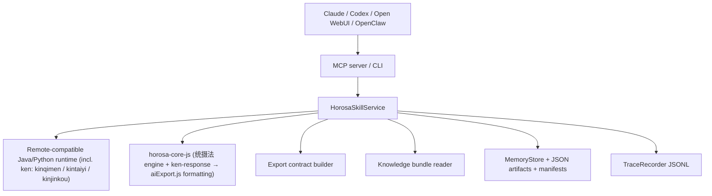

# Architecture

## 总览

Horosa Skill 由五层组成：

1. Python skill surface
2. Java / Python / Node runtime
3. Xingque export protocol layer
4. Local memory + trace
5. Bundled hover knowledge

## 结构图

## ken 计算后端（v0.6.0）

奇门遁甲（`qimen`）、太乙神数（`taiyi`）、金口诀（`jinkou`）以及三式合一（`sanshiunited`）里的奇门 + 太乙，统一由星阙的 **ken 后端**计算，与星阙桌面端同源：

- `kinqimen` / `kintaiyi` / `kinjinkou` 三个引擎挂载在本地 Python chart 服务上，对外暴露 `/qimen/pan`、`/taiyi/pan`、`/jinkou/pan`。
- `service.py` 的 `_run_{qimen,taiyi,jinkou}_tool` 先取必要 scaffold（qimen 取 nongli/jieqi，jinkou 取 liureng），再调用对应 ken 端点，把 `ken_response` 传给 `horosa-core-js`。
- `horosa-core-js` 不再自己起盘，只做 **ken-response → aiExport.js** 的格式化：用星阙的 `normalizeKinqimenData` / `normalizeBackendPan` / `normalizeKinjinkouData` 把 ken 结果叠加到本地 scaffold 上，再由 `build*SnapshotText` 输出 `export_snapshot` 所需的 section。
- ken 是唯一计算权威，JS 是表现层；若 `ken_response` 缺失或结构不完整，JS 会退回本地 scaffold 以保证不崩，但正常路径始终以 ken 为准。
- 这三个引擎已随离线 runtime 一起打包（`vendor/{kinqimen,kintaiyi,kinjinkou}`），macOS / Windows 均可断网运行；`tongshefa` 仍是纯 headless JS（无 ken 引擎）。

## 核心模块

- `src/horosa_skill/service.py`
  - 调度 tool、dispatch、export contract、memory write-back
- `src/horosa_skill/runtime/manager.py`
  - install / doctor / start / stop
- `src/horosa_skill/knowledge/store.py`
  - 本地悬浮知识读取
- `src/horosa_skill/memory/store.py`
  - SQLite + JSON artifact + run manifest
- `src/horosa_skill/tracing.py`
  - trace / group / workflow JSONL

## 数据流

- tool run
  - 输入 schema 校验
  - runtime / local engine 执行
  - export_snapshot + export_format
  - trace 记录
  - artifact / manifest 写入
- dispatch
  - 自然语言选工具
  - 共享 group_id
  - 子工具各自 trace_id
  - 汇总 export contract
